0034-drg-scopes-test
--------------------

### Description ###

DMN Model [0034-drg-scopes.dmn](./0034-drg-scopes.dmn) tests DMN specification conformance of `information requirement scoping and knowledge requirement scoping`.

#### Specification Reference(s): ####
 * DMN 1.1 - 7.1 Introduction

### Description ###
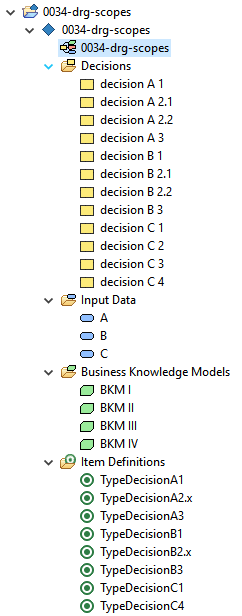

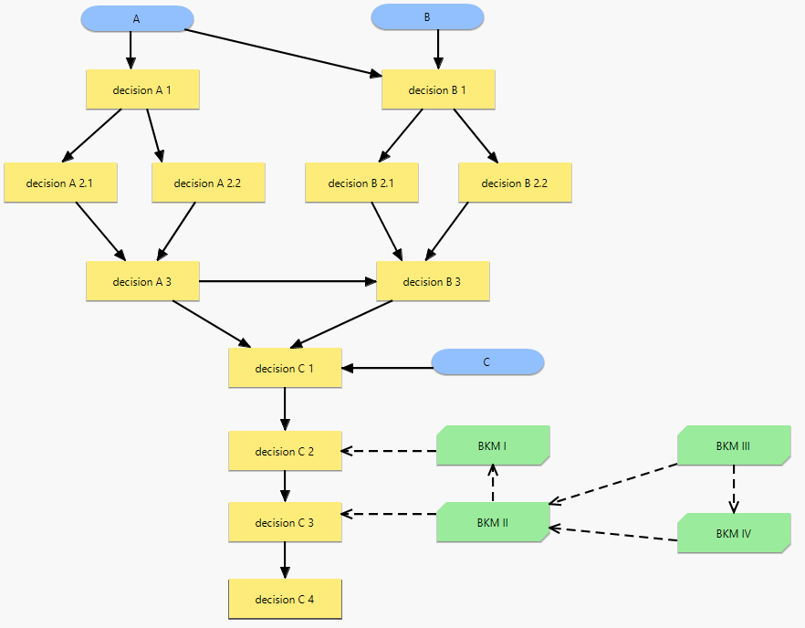

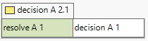 

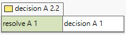

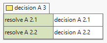

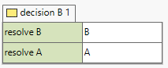

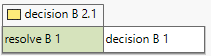

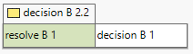

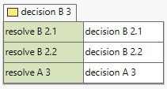

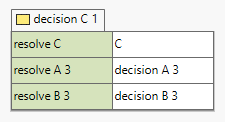

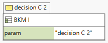

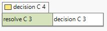

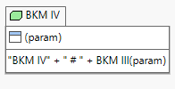

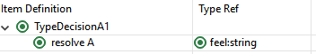

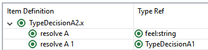

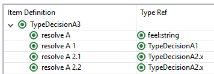

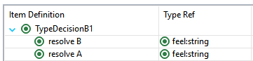

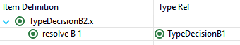

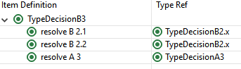

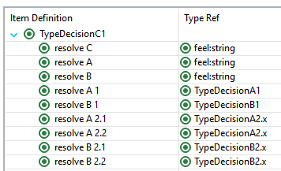

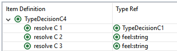

### Disclaimer ###
Site manually created by [ACTICO GmbH](https://actico.com) for [Technology Compatibility Kit (TCK)](https://dmn-tck.github.io/tck/) for the Decision Model and Notation (DMN) standard.

[DMN 1.1. Specification Document](http://www.omg.org/spec/DMN/1.1/) 
  