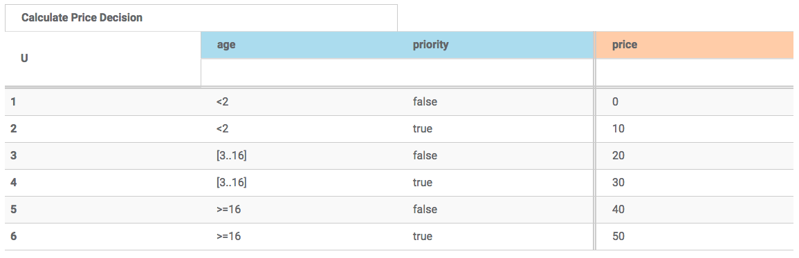
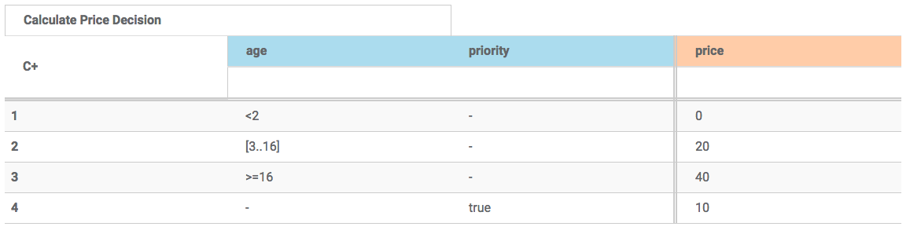
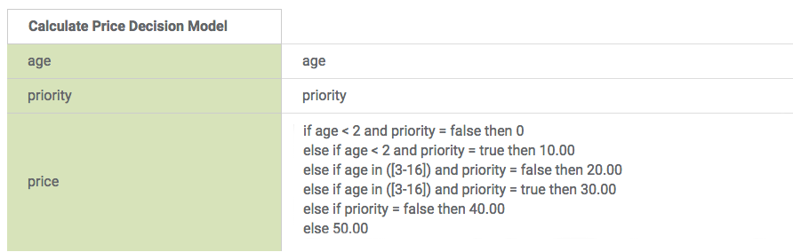

This example provides several models demonstrating different ways to achieve a single decision over the price of a ticket based on age and whether the applicant wants priority service.

#Variant 1: A unique hit count decision table

#Variant 2: A collecting hit count decision table

#Variant 3: A boxed expression

#Test inputs and outputs

6 test inputs and associated outputs are provided exercising all permutations.

JSON and XML variations of the same test data are provided.
